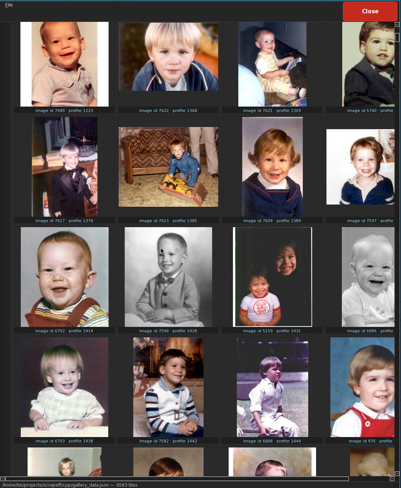

# cryobankscraper

C++ scraper for Fairfax Cryobank donors, there are missing ids for donors that don't exist and donors that do not have photos.. It fetches donor URLs, extracts photos from each profile, and writes a JSON gallery you can browse in the Qt app.

```cpp
// Core scraping orchestration (src/scrape_runner.cpp)
bool runScrape(const ScrapeSettings &settings)
{
    scrapeff::applySslFromEnv();
    writeTruncatedFiles(settings);
    Shared sh;
    sh.logLine = settings.logLine;
    sh.galleryJsonPath = QDir(settings.workDir).filePath(QStringLiteral("gallery_data.json"));
    // ...
    QtConcurrent::blockingMap(urlList, [&](const QString &u) {
        QNetworkAccessManager nam;
        processOneRequestedUrl(u, sh, nam, settings.httpProfile);
    });
    // ...
}
```

## Build

Requires Qt 6 (Core, Gui, Network, Widgets, Concurrent) and CMake 3.20+.

```bash
cmake -S . -B build
cmake --build build
```

Binaries:

- `build/scrapeff` — default CLI scraper (Chromium-style HTTP, parallel workers)
- `build/scrape_requests` — same scraper with Python `requests`-compatible HTTP (single-threaded)
- `build/gallery_qt` — desktop gallery; runs a scrape on launch if `gallery_data.json` is missing

## How it scrapes

1. **Build a URL list** in the working directory:
   - Reads `base_urls.txt` (default: `https://fairfaxcryobank.com/search/donorprofile.aspx?number=`).
   - For Fairfax profiles, also harvests links from the "meet our newest donors" listing page.
   - Generates candidate URLs for donor IDs `0` … `9999` (override with `SCRAPEFF_FAIRFAX_MAX_ID`), trying both padded (`0428`) and unpadded (`428`) `number=` values.
   - Merges any extra URLs from `target_urls.txt`.
   - Writes the final list to `target_urls.txt`.

```cpp
// URL generation with padding variants (src/cli_scrape.cpp)
static QString fairfaxDonorNumberSuffix(int donorId)
{
    return QString::number(donorId).rightJustified(4, QLatin1Char('0'));
}

static QStringList donorNumberSuffixVariants(int donorId)
{
    const QString padded = fairfaxDonorNumberSuffix(donorId);
    const QString unpadded = QString::number(donorId);
    if (padded == unpadded)
        return {padded};
    return {padded, unpadded};
}

QStringList buildTargetUrls(const QStringList &baseUrls)
{
    QSet<QString> seen;
    QStringList out;
    const int maxId = fairfaxMaxDonorIdExclusive();
    for (const QString &b : baseUrls) {
        for (int i = 0; i < maxId; ++i) {
            for (const QString &suffix : donorNumberSuffixVariants(i)) {
                const QString p = QStringLiteral("%1%2").arg(b).arg(suffix);
                if (!seen.contains(p)) {
                    seen.insert(p);
                    out.append(p);
                }
            }
        }
    }
    sortUrlsByDonorId(out);
    return out;
}
```

2. **Fetch each profile page** over HTTPS using Chromium automation (see below).

```cpp
// Blocking HTTP fetch with retry logic (src/scrape_runner.cpp)
int getHtmlPage(QNetworkAccessManager &nam, const QUrl &url, QString *htmlOut, QUrl *effectiveOut,
                  scrapeff::HttpClientProfile profile)
{
    for (int attempt = 0; attempt < kMaxRetryAttempts; ++attempt) {
        const QString navRef = htmlNavigationReferrerForUrl(url);
        QNetworkRequest req = makeHtmlReq(profile, url, kHtmlTransferTimeoutMs, navRef);
        QByteArray body;
        const int st = blockingGet(nam, req, &body, effectiveOut, profile);
        if (st == 200) {
            *htmlOut = QString::fromUtf8(body);
            return 200;
        }
        if (st == 429 || st == 403 || st == 500 || st == 502 || st == 503 || st == 504) {
            QThread::msleep(kRetryBaseDelayMs * (1 << attempt));  // 400ms, 800ms, 1600ms
            continue;
        }
        // ...
    }
    return 0;
}
```

## Chromium automation

The default `scrapeff` binary uses the **ChromiumAutomation** HTTP profile, which mimics a real Chrome browser session to avoid bot detection by CDNs and WAFs (e.g., Cloudflare). This involves:

**HTTP headers** — Each request includes headers that Chrome sends but simple HTTP clients omit:
- `User-Agent`: Chrome 122 on Windows (`Mozilla/5.0 (Windows NT 10.0; Win64; x64) AppleWebKit/537.36 ...`)
- Client Hints: `sec-ch-ua`, `sec-ch-ua-mobile`, `sec-ch-ua-platform`
- Fetch Metadata: `Sec-Fetch-Dest` (document or image), `Sec-Fetch-Mode` (navigate or no-cors), `Sec-Fetch-Site` (same-origin, cross-site, or none), `Sec-Fetch-User` (for navigation)
- `Accept` header tuned for content type (HTML vs. images)
- `Upgrade-Insecure-Requests: 1` for document fetches
- `Referer` header set to the profile search page for Fairfax donor URLs

**Request pacing** — A global mutex enforces ~150 ms spacing between HTTP request starts (configurable via `SCRAPEFF_HTTP_SPACING_MS`). This prevents rapid-fire requests that trigger rate limiting.

**HTTP/1.1 only** — HTTP/2 is disabled (`Http2AllowedAttribute = false`) because HTTP/2's TLS fingerprint differs from typical urllib3/requests stacks, and some bot detectors key on this.

**Parallel workers** — Requests run on up to 4 threads (override with `SCRAPEFF_THREADS`). Each worker creates its own `QNetworkAccessManager` to avoid thread-safety issues.

**Retry logic** — On 429, 403, or 5xx responses, the scraper waits (exponential backoff starting at 400 ms) and retries up to 3 times. Network errors (status 0) also retry with a shorter initial backoff.

The alternate profile, `PythonUrllibCompatible`, uses minimal headers (`User-Agent: python-requests/2.32.3`), no pacing, and runs single-threaded with a shared cookie jar — useful for comparing behavior or debugging.

3. **Parse HTML** with Gumbo: find images inside `div.main` → `div.foto` (or `#main` / `#foto`).

4. **Download each image** and verify it decodes as a real image. One gallery tile per donor profile ID is kept.

5. **Write outputs** to the working directory:
   - `gallery_data.json` — main gallery data (`page`, `src`, `did`, `profile_number`)
   - `gallery.html` — static HTML gallery
   - `image_urls.txt`, `fetch_failed.txt`, `profile_urls_before_image_extract.txt`
   - `childhood_photo_did_counts.json` — counts per `ChildhoodPhoto.ashx?did=` id

Donors with a real photo use `ChildhoodPhoto.ashx?did=…`. Donors without one show a shared placeholder (`search-temp-01.jpg`).

## Gallery



`gallery_qt` loads `gallery_data.json` (or scrapes first). By default it shows only donors **with profile pics** (real `ChildhoodPhoto` URLs), sorted by donor id low → high. Use **Filter → All donors** to include placeholders.

## Useful environment variables

| Variable | Purpose |
|---|---|
| `SCRAPEFF_THREADS` | Parallel workers for `scrapeff` (default 4) |
| `SCRAPEFF_FAIRFAX_MAX_ID` | Upper bound for brute-force donor IDs (default 10000) |
| `SCRAPEFF_FAIRFAX_SKIP_BRUTE_IDS=1` | Only scrape URLs found on the listing page |
| `SCRAPEFF_TARGET_URLS_ONLY=1` | Use `target_urls.txt` only, skip generation |
| `SCRAPEFF_HTTP_PROFILE=urllib` | Python-requests-style client (or use `scrape_requests`) |

Run the CLI from the directory where you want output files written (`target_urls.txt`, `gallery_data.json`, etc.).
